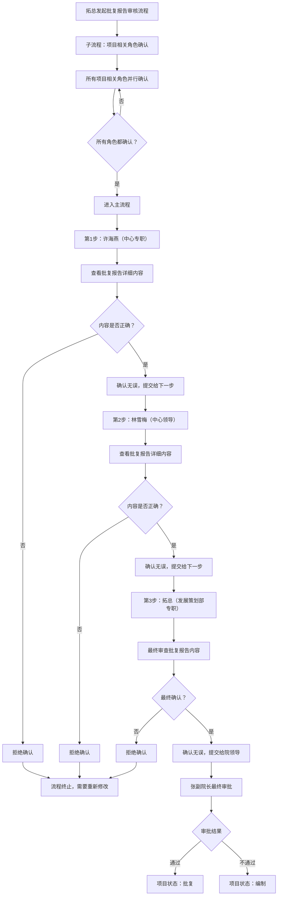

# 批复报告审批流程修改说明

## 🔧 修改内容

### 1. 用户数据修正
- **邵剑** → **邵主任**：修改了用户数据中的姓名，使其更加规范

### 2. 严格顺序审批流程
实现了批复报告的严格顺序确认机制：

#### 子流程（并行确认）
- 项目相关角色同时确认批复报告中涉及的项目信息

#### 主流程（严格顺序）
1. **第1步：许海燕（中心专职）**
   - 查看批复报告详细内容
   - 确认项目信息、财务数据等是否正确
   - 确认后，林雪梅才能看到待办

2. **第2步：林雪梅（中心领导）**
   - 审查批复报告内容
   - 确认项目可行性和必要性
   - 确认后，拓总才能看到待办

3. **第3步：拓总（发展策划部专职）**
   - 最终审查批复报告内容
   - 确认所有信息准确无误
   - 确认后，分管院领导才能看到审批任务

4. **最终审批：张副院长（分管院领导）**
   - 进行最终审批决策
   - 通过 → 项目状态变为"批复"
   - 不通过 → 项目状态变为"编制"

### 3. 待办列表优化
- **详细内容显示**：在待办列表中显示批复报告的完整详细内容
- **智能格式化**：金额显示为货币格式，百分比自动添加%符号
- **用户友好**：清晰的内容分区和直观的项目列表
- **操作指导**：提供友好的提示信息，引导用户重点检查关键内容

### 4. 测试数据生成
添加了完整的测试数据生成功能：
- **测试批复报告**：包含详细的tableData内容
- **测试待办事项**：为许海燕创建主流程第1步待办
- **测试确认记录**：模拟子流程已完成的状态

## 🧪 测试方法

### 1. 初始化测试数据
1. 访问储备项目管理页面
2. 点击"初始化数据"按钮
3. 系统会生成测试批复报告和待办事项

### 2. 测试审批流程
1. **切换到许海燕账号**
   - 在待办列表中可以看到"批复报告主流程确认"任务
   - 点击任务查看详细的批复报告内容
   - 确认后提交

2. **切换到林雪梅账号**
   - 许海燕确认后，林雪梅才能看到待办任务
   - 审查批复报告内容并确认

3. **切换到拓总账号**
- 林雪梅确认后，拓总才能看到待办任务
   - 进行最终确认

4. **切换到张副院长账号**
   - 三步确认完成后，张副院长才能看到最终审批任务
   - 进行审批决策

### 3. 验证功能点
- ✅ 严格的顺序流转：只有前一个角色确认后，下一个角色才能看到待办
- ✅ 详细内容显示：能够看到批复报告的完整tableData内容
- ✅ 格式化显示：金额、百分比等数据正确格式化
- ✅ 状态变更：最终审批通过/不通过后项目状态正确变更

## 📊 流程图

## 🎯 核心特性

1. **权限控制**：确保只有相应角色在相应时间才能看到待办任务
2. **内容展示**：完整显示批复报告的详细内容，便于审查
3. **流程管控**：严格按照顺序进行确认，不允许跳过步骤
4. **状态追踪**：实时更新审批状态和流程进度
5. **用户体验**：友好的界面提示和操作指导

## 🚀 使用建议

1. **数据初始化**：每次测试前先初始化数据，确保有完整的测试环境
2. **角色切换**：按照流程顺序切换不同角色进行测试
3. **内容审查**：重点关注批复报告详细内容的显示效果
4. **流程验证**：确认每个步骤的权限控制都正常工作

---

**修改完成时间**：2024年12月20日  
**修改人**：Claude AI Assistant  
**版本**：v1.0 